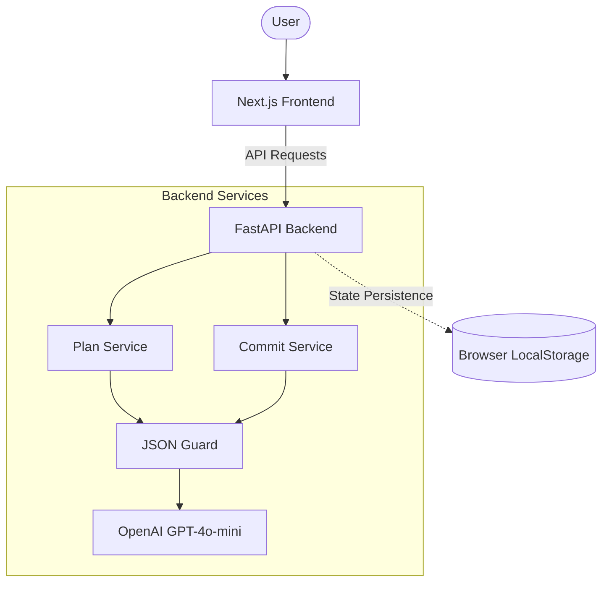

# WorkflowArchitect (Agentic AI Orchestrator)


An agentic workflow orchestrator designed to bridge the gap between planning and execution. Dev Flow AI provides a high-reliability interface for generating structured release plans (**MicroPlanner**) and semantic commits (**CommitSense**), leveraging deterministic guardrails for LLM interactions.

## Stack

- **Frontend**: Next.js 14 (App Router), TypeScript, TailwindCSS.
- **Backend**: FastAPI, Pydantic v2, Datapizza AI (OpenAI Client).
- **LLM Guard**: Deterministic JSON logic with Retry mechanism (see ADR-001).
- **State**: Client-side persistence via `localStorage`.

## Architecture Diagram



## Setup & Installation

### 1. Prerequisites
- Python 3.11+
- Node.js 18+
- Docker (Optional)

### 2. Backend Setup
```bash
cd backend
python -m venv .venv
source .venv/bin/activate  # or .\.venv\Scripts\activate on Windows
pip install -r requirements.txt
cp .env.example .env
```
*Note: Ensure `OPENAI_API_KEY` is configured in `.env`.*

### 3. Frontend Setup
```bash
cd frontend
npm install
npm run dev
```

## API Contract

| Endpoint | Method | Status | Notes |
| --- | --- | --- | --- |
| `/health` | GET | Real | System health check. |
| `/api/plan` | POST | Real | Generates a structured 3-step release plan. |
| `/api/commit` | POST | Real | Analyzes changes and drafts a semantic commit. |
| `/api/pr` | POST | Planned | Automated PR description generator. |

## Architectural Decision Records (ADR)

We maintain a strict ADR process for all mission-critical design choices:

- [ADR-001: Deterministic JSON Guard for LLM Output](./docs/decisions/ADR-001-deterministic-json-guard.md)
- [ADR-002: Client-side State Persistence via LocalStorage](./docs/decisions/ADR-002-frontend-local-storage.md)

## Security & Reliability

- **Secrets**: No hardcoded keys. All configurations are injected via environment variables.
- **Reliability**: Uses a retry-based JSON Guard to handle non-deterministic LLM failures.
- **Privacy**: Local-first state management; no sensitive data is stored on our servers.

## Known Limitations

- **Authentication**: No built-in auth layer (Trade-off: Prioritized workflow speed for local developers).
- **Database**: Lacks persistent server-side storage (Trade-off: `localStorage` reduces infra complexity).
- **Monolithic Frontend**: The UI logic is currently consolidated in a high-density primary page (Trade-off: Prioritized rapid feature iteration and "Vibe Coding" over complex component atomicity; recommended for future refactoring into shared UI primitives).

## Credits

Developed and maintained by **Federico Orsi**.
