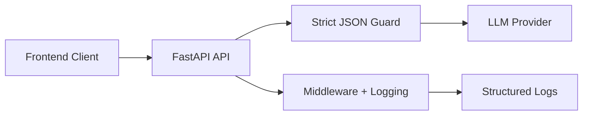

# Dev Flow AI Backend


FastAPI backend for the Dev Flow AI agentic workflow (Plan -> Commit -> PR), with schema-guarded LLM responses and operational middleware for reliability.

## Stack

- Python 3.11+
- FastAPI + Pydantic
- Structlog JSON logging
- Datapizza/OpenAI provider integration

## Architecture Diagram



## Setup

```bash
python -m venv .venv
. .venv/Scripts/activate
pip install -r requirements.txt
pip install -r requirements-dev.txt
```

Optional provider packages:

```bash
pip install -U datapizza-ai datapizza-ai-clients-openai
```

## Environment

Copy `.env.example` to `.env` and set project-specific values.

| Variable | Description | Default |
| --- | --- | --- |
| `APP_NAME` | FastAPI app name | `DevFlow AI` |
| `CORS_ORIGINS` | Comma-separated allowed origins | `http://localhost:3000` |
| `LOG_LEVEL` | Logging level | `INFO` |
| `RATE_LIMIT_PER_MINUTE` | Per-IP request cap | `60` |
| `LLM_TIMEOUT_SECONDS` | LLM call timeout | `30` |
| `OPENAI_API_KEY` | Provider key (never commit real values) | placeholder |
| `MODEL_NAME` | Default model | `gpt-4o-mini` |
| `ENABLE_TRACING` | LLM tracing toggle | `false` |
| `DATABASE_URL` | Optional DB connection string | placeholder |

## Run

```bash
make run
```

Equivalent command:

```bash
uvicorn app.main:app --reload --port 8000
```

## API Contract (Real vs Planned)

| Endpoint | Method | Status | Notes |
| --- | --- | --- | --- |
| `/health` | GET | Real | Service health check |
| `/api/plan` | POST | Real | MicroPlanner result |
| `/api/commit` | POST | Real | CommitSense result |
| `/api/pr` | POST | Real | PR Builder aggregation |

## Operations & Observability

- `Rate Limiting Middleware`: per-client request throttling to prevent abuse and noisy traffic.
- `Request-ID`: every request is tagged with `X-Request-Id` for end-to-end traceability.
- `Structlog`: JSON structured logs suitable for ingestion into ELK-compatible pipelines.

## Make Commands

- `make run`
- `make test`
- `make lint`
