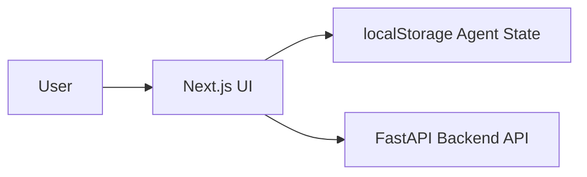

# Dev Flow AI Frontend


Next.js frontend for the Dev Flow AI workflow UI (Plan -> Commit -> PR).

## Stack

- Next.js 14
- React 18
- TypeScript
- Tailwind CSS + Radix UI

## Architecture Diagram



## Prerequisites

- Node.js v20+
- `pnpm` or `npm`

## Setup

```bash
npm install
```

## Run

```bash
npm run dev
```

Open `http://localhost:3000`.

## Environment

- `NEXT_PUBLIC_API_BASE_URL` (optional): Backend base URL. Defaults to `http://localhost:8000` in local workflows.

## API Contract (Real vs Planned)

| API Surface | Status | Notes |
| --- | --- | --- |
| Plan (`POST /api/plan`) | Real | Triggered by PLAN mode |
| Commit (`POST /api/commit`) | Real | Triggered by COMMIT mode |
| PR (`POST /api/pr`) | Real | Aggregates commit outputs |

## Data Persistence

Agent session state is persisted in `localStorage` to keep the backend stateless. This is an intentional stateless-backend pattern for portfolio simplicity, with the trade-off that state is browser-local and not centralized.

## Testing Strategy

- Component/unit testing target: `Vitest` with React Testing Library.
- End-to-end readiness: UI and route structure are compatible with Playwright-based browser flows.
- Current repository focus: architecture and workflow demonstration; expand automated frontend test suites as a follow-up hardening step.

## Tooling

```bash
npm run lint
npm run format
```
